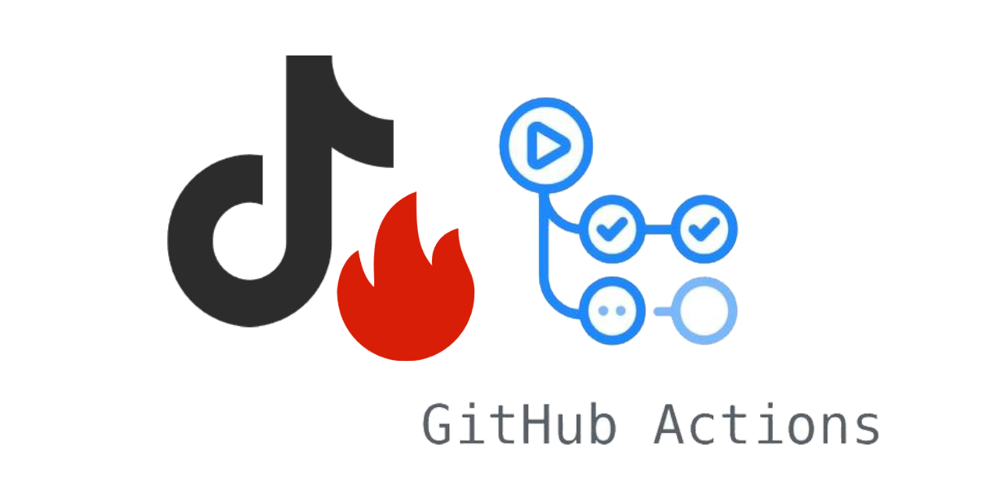

# DouYin Spark Flow




> 本仓库是 [`2061360308/DouYinSparkFlow`](https://github.com/2061360308/DouYinSparkFlow) 的**分发与集成仓库**：保留上游（MIT）全部源码，并补上多用户 Web 控制台、Android 客户端、Windows Cookie 导出工具，以及可直接校验的成品下载。
>
> 自动化操作可能导致验证码、限流、功能限制、账号封禁或登录态失效。请只操作你本人拥有或已获得明确授权的账号。

## 🎁 在线多用户控制台，免部署

不方便自行部署的用户，可以直接使用已部署的在线控制台。

这是由自建提供的在线服务，与源码仓库**分开运营**，请自行评估风险后使用，并先阅读其服务条款与隐私做法。

**在线入口：[https://124.220.96.161/](https://124.220.96.161/)**

> 进入前请先确认域名与证书。请勿向他人提供账号密码、短信验证码或抖音登录凭证，并合理控制任务数量与发送频率。
>
> 想自己掌控数据，请直接跳转到下文[多用户面板自建](#多用户面板自建)。

## 贡献者

感谢所有为本项目做出贡献的开发者：

[](https://github.com/BARONCMH/DouYinSparkFlow-OpenSource/graphs/contributors)

## 📌 项目介绍

**抖音火花自动续火脚本**，一款轻量实用的抖音互动脚本，可自动为你和抖音好友续火花，无需手动操作。

✅ 支持 Docker 部署至自有服务器，容器内 cron 定时执行（推荐）

✅ 支持 GitHub Actions 运行（`schedule.yml` 仅限手动触发，Fork 后不会自动跑）

✅ 配套多用户 Web 控制台，支持注册 / 兑换 / 发送记录 / Web Push 通知

✅ 提供 Android 客户端与 Windows Cookie 导出工具，装完即用

使用 `Playwright` 以及 `chrome-headless-shell` 自动化操作[抖音聊天网页版](https://www.douyin.com/chat)，进行定时发送抖音消息来续火花

### 本仓库相对上游的增量

| 目录 | 说明 |
|---|---|
| `server-panel/` | 多用户面板与 worker overlay（`panel.py` + `tasks.py` + `compose.yml`） |
| `android/` | HTTPS-only WebView 客户端源码，含账号切换与发送结果通知 |
| `cookie-tool/` | Windows Cookie 导出工具源码与打包脚本 |
| `downloads/` | 成品 APK / EXE 及配套 `.sha256` |

其余目录按上游原样保留，方便随时与上游对 diff。

### 特性/优势

- [x] 在线可视化配置工具，新手也能入门操作
- [x] Fork 即用，无需克隆代码，配置运行环境
- [x] 多用户，同时批量支持多个账户
- [x] 多目标，一个账户支持多个续火花目标
- [x] 支持按照昵称和抖音号两种方式查找好友目标
- [x] 一言支持，更丰富的消息文本
- [x] 抓 Cookie 与跑任务的出口 IP 一致（同机双容器 + gost 隧道，避免登录态被判异常）
- [x] 移动端可用：Android 客户端，iOS 直接把站点添加到主屏幕

## 🚀 使用方法

教程见仓库内文档站，直接打开 `docs/index.html` 即可浏览：

| 主题 | 文档 |
|---|---|
| 选择部署方式 | [docs/guide/01-选择部署方式.md](docs/guide/01-选择部署方式.md) |
| Cookie 与出口 IP | [docs/guide/02-cookie与出口IP.md](docs/guide/02-cookie与出口IP.md) |
| 配置生成器 | [docs/guide/03-配置生成器.md](docs/guide/03-配置生成器.md) |
| Docker 部署（推荐） | [docs/deploy/docker.md](docs/deploy/docker.md) |
| 云函数部署 | [docs/deploy/fc.md](docs/deploy/fc.md) |
| 源码部署 | [docs/deploy/source.md](docs/deploy/source.md) |
| 常见问题 | [docs/faq/faq.md](docs/faq/faq.md) |

### 单用户 Docker 部署

```bash
git clone https://github.com/BARONCMH/DouYinSparkFlow-OpenSource.git
cd DouYinSparkFlow-OpenSource
cp .env.example .env      # 填 TASKS 与 COOKIES_<unique_id>，并设 GOST_USER / GOST_PASSWORD
docker compose up -d --build
docker compose logs -f
```

- `TASKS` 与 `COOKIES_<unique_id>` 必填，里面的 JSON 必须写成**单行**；`COOKIES_` 后缀要与 `TASKS` 里该账号的 `unique_id` 完全一致
- Cookie 要用浏览器导出的 **JSON 数组**，不能填 `sessionid=xxx; ttwid=yyy` 这种原始字符串
- 建议填上 `fingerprint` 锁定指纹种子；不填则每轮随机，指纹一变账号容易触发风控
- 定时点由 `.env` 的 `CRON_HOUR` / `CRON_MINUTE` / `CRON_SECOND` 加 `TZ` 决定，容器内 cron 到点执行，不用动宿主机 crontab
- `docker compose` 默认直接拉现成镜像，国内需要先 `docker login` 对应 registry（地址见 `docker-compose.yml` 注释）；不想登录可以加 `build:` 段本地构建

### 多用户面板自建

面板是 **overlay**，不是独立镜像：以上游镜像为底座，挂载 `panel.py` 与 `tasks.py`。

```sh
# 1) 私有目录（只在本机存在，绝不提交）
mkdir -p server-panel/config server-panel/logs
cp .env.example server-panel/config/.env

# 2) 面板环境，必须设 PANEL_PASSWORD 与 WEBPUSH_SUBJECT
cp server-panel/panel.env.example server-panel/panel.env

# 3) 想让面板的下载路由提供成品，就把 downloads/ 里的文件放进去
mkdir -p server-panel/logs/app-downloads

# 4) 启动
cd server-panel && docker compose --env-file panel.env -f compose.yml up -d
```

面板在容器内监听 `8080`，映射到宿主机 `127.0.0.1:18080`，前面需要自备带有效证书的 TLS 反向代理，不要把端口直接暴露到公网。`PANEL_IMAGE` 必须与上游接口匹配，升级前先看上游 release notes。完整说明见 [`server-panel/README.md`](server-panel/README.md)。

### Android 客户端与 Cookie 工具

```powershell
cd android
.\gradlew.bat assembleDebug -PsiteUrl=https://你的域名/
```

需要 Android SDK Platform 35 与 Build Tools 35.0.0。默认 origin 是 `https://example.com/`，所以自己构建的 APK 不会不小心登进托管服务。成品在 `downloads/`，安装前请先校验配套的 `.sha256`：

```bash
sha256sum -c downloads/DouYinSparkFlow.apk.sha256
```

Windows Cookie 工具源码在 `cookie-tool/`，成品是 `downloads/Get-Douyin-Cookies.exe`。它在本地导出 `douyin_cookies.json`，请**把它当密码对待**，导入 `.env` 之后立即删除。

## 📢交流讨论

上游仓库已开放讨论区，有关脚本本体的疑问或成果展示，可以到那里发话题：

[跳转上游讨论区](https://github.com/2061360308/DouYinSparkFlow/discussions)

多用户面板、Android 客户端、Cookie 工具相关的问题，请提到本仓库的 Issues：

[本仓库 Issues](https://github.com/BARONCMH/DouYinSparkFlow-OpenSource/issues)

## ⭐Star 趋势

[](https://www.star-history.com/#BARONCMH/DouYinSparkFlow-OpenSource&Date)

## ⚠️ 免责声明

1. 本项目为**开源学习用途**，仅用于技术研究和个人自用，严禁用于商业用途、恶意刷量或违反抖音平台规则的行为。
2. 本仓库为第三方公开发布，与抖音及其关联方不存在隶属、授权、赞助、代理或合作关系；项目名称中的"抖音"仅用于说明兼容目标或使用场景。
3. 使用本脚本产生的一切风险（包括但不限于抖音账号限流、封禁、处罚、登录态失效、数据丢失等）均由使用者自行承担，项目开发者不承担任何责任。
4. 若使用上文提到的在线控制台，账号信息、Cookie 与发送记录会保存在该服务的服务器上，请自行评估并遵守其条款；也可以按"多用户面板自建"一节自行部署，自行掌控数据。
5. 本项目仅调用公开的接口/模拟人工操作，不涉及破解、入侵抖音系统，使用者需遵守《抖音用户服务协议》及相关法律法规。
6. 请合理控制脚本运行频率，避免给抖音平台服务器造成压力，建议仅用于个人少量好友的火花维系。
7. 若你使用本项目即表示已阅读并同意本免责声明，如不同意请立即停止使用。

## 📄 开源协议

本项目基于 MIT 协议开源，你可以自由使用、修改和分发本项目代码，详见 [LICENSE](LICENSE) 文件。

上游源码来自 [`2061360308/DouYinSparkFlow`](https://github.com/2061360308/DouYinSparkFlow)（Copyright 2026 2061360308 盧瞳，MIT），上游 `LICENSE` 原样保留；本仓库新增的 `server-panel/`、`android/`、`cookie-tool/` 同样采用 MIT 协议，除非文件内另有说明。第三方依赖、图标、字体、截图、商标及平台内容不自动继承本项目许可，详见 [NOTICE.md](NOTICE.md)。
